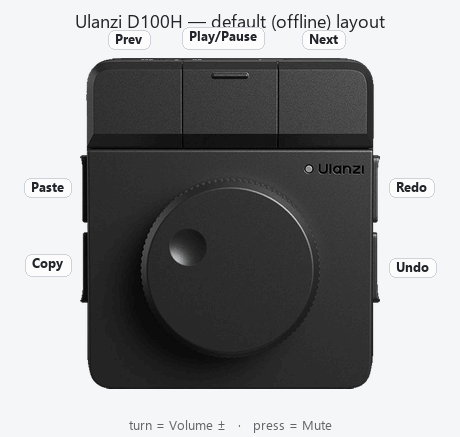
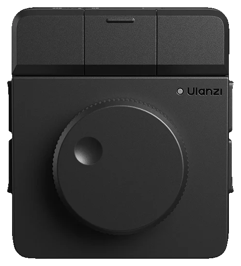
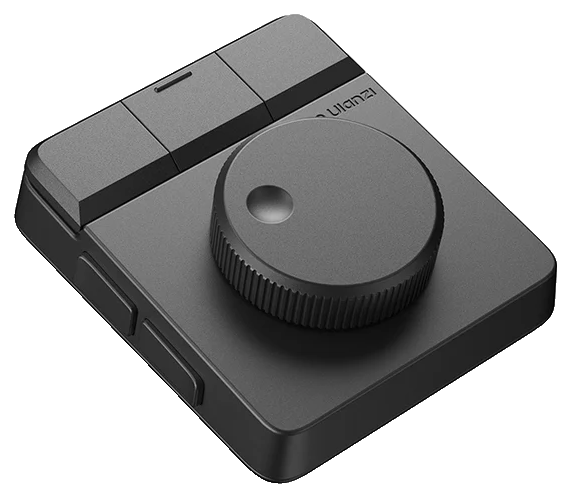
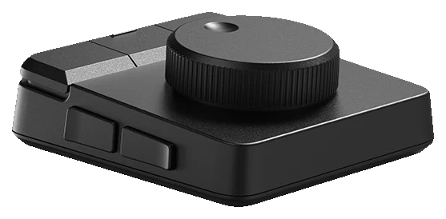
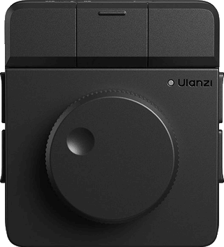

# ulanzi-d100h-homebrew

> Community reverse-engineering notes for the **Ulanzi D100H Dial Creative Controller** — how it
> actually works at the HID level, how Ulanzi Studio stores its config, and the gotchas you'll hit
> building your own integration. Unofficial; gathered by poking at a real unit on Windows 11.

_Layout + full specs confirmed against the [official Ulanzi manual](docs/specs.md)._

> 🌀 **Also in this repo — an on-screen D100H you can drop into your own app.** Like the controller
> "skins" on gamepadviewer.com: a picture of the dial that **moves like the real one** — turn the knob and
> the on-screen knob spins; press a key and it lights up. The image layers + how-to are in
> **[docs/dial-skin.md](docs/dial-skin.md)**. (The diagram + GIFs above were built from those layers with
> [`rembg`](https://github.com/danielgatis/rembg) for background removal + [Pillow](https://python-pillow.org).)

## The device & official links
- 🛒 **Ulanzi D100H Dial Creative Controller** — product page / specs / where to buy:
  https://www.ulanzi.com/products/d100h-dial-creative-controller-i003
- 📄 **Manual:** https://manuals.plus/ulanzi/d100h-dial-creative-controller-manual
- 📚 **Ulanzi docs & user guides:** https://www.ulanzi.com/pages/documentation
- ⬇️ **Ulanzi Studio app + firmware downloads:** https://www.ulanzi.com/pages/downloads
- 💬 **Community forum** (has a D100H FAQ thread): https://bbs.ulanzistudio.com/
- 🧩 **UlanziDeck plugin SDK:** https://github.com/UlanziTechnology/UlanziDeckPlugin-SDK

More — including the related D200 reverse-engineering projects — in [docs/resources.md](docs/resources.md).

## Why this exists
The D100H is a cheap, genuinely nice Bluetooth dial + 7-button macro pad. If you want to drive *your
own* software with it instead of Ulanzi Studio's built-in presets, you run into a wall of undocumented
behavior. This repo collects everything I found the hard way so you don't have to.

## TL;DR — the things that'll save you hours
1. **It's Bluetooth-only** (USB-C charges only, no data) and enumerates over HID as
   **`KEHWIN / Dial_Lite`, VID `0xfff1` PID `0x0082`** — *not* an obvious "Ulanzi" ID.
2. **Offline = fixed defaults. You cannot save a custom layout to the device.** Any remap you make in
   Ulanzi Studio only works *while Studio is running*. Close Studio and the dial reverts to
   volume/media/copy-paste. (Tested directly — see [docs/ulanzi-studio.md](docs/ulanzi-studio.md).)
3. **The defaults are standard HID:** dial = volume up/down/mute (Consumer page, **readable**); 3 buttons
   = media prev/play/next (**readable**); 4 buttons = Ctrl+C/V/Z/Y (Keyboard page — **Windows blocks
   apps from reading this**, so those 4 are invisible to `node-hid`).
4. **So a no-app, HID-only homebrew tops out at: the dial + 3 buttons, and it'll move your volume.**
   For all 7 buttons cleanly you need Studio running (a plugin, or a hotkey remap + a listener).
5. **Plugins work.** A third-party UlanziDeck plugin's actions show up in Studio's action list and bind
   to the D100H's dial + keys fine. That's the clean path to custom behavior.

## Contents
- **[docs/hardware.md](docs/hardware.md)** — specs, USB/HID IDs, the 5 HID interfaces it exposes
- **[docs/offline-protocol.md](docs/offline-protocol.md)** — exact default codes + report formats (sniff output)
- **[docs/ulanzi-studio.md](docs/ulanzi-studio.md)** — online mode, where/how Studio saves bindings, the saving gotchas
- **[docs/plugin-sdk.md](docs/plugin-sdk.md)** — writing a UlanziDeck plugin + the SDK pitfalls
- **[docs/resources.md](docs/resources.md)** — official docs, the plugin SDK, the forum, related open-source projects
- **[docs/dial-skin.md](docs/dial-skin.md)** — on-screen "gamepadviewer-style" D100H (knob spins, keys light up) — assets + method
- **[tools/sniff.js](tools/sniff.js)** — a tiny `node-hid` script to dump what *your* unit sends

## Gallery
Transparent dial PNGs (in [`docs/images/`](docs/images)) — and the dial **in action** (knob spins, keys flash white):

  
  
  
  

Interactive version — the spin/press method + assets: **[docs/dial-skin.md](docs/dial-skin.md)** (from [chumthesizer](https://github.com/brendanwelsh/chumthesizer)).

## More from the author
Other Ulanzi projects by [@brendanwelsh](https://github.com/brendanwelsh):
- **[chumthesizer](https://github.com/brendanwelsh/chumthesizer)** (CHUM-1) — a browser/Electron
  groovebox synth you play with real hardware: the **D100H dial** warps the sound (turn = FX macro,
  press = play/stop) and its **7 keys switch the sounds**, alongside an Apple Magic Trackpad and a
  Stream Deck pedal. A fun, musical example of driving software from the dial.
- **[ulanzi-camera-switcher](https://github.com/brendanwelsh/ulanzi-camera-switcher)** — drive a live
  security-camera viewer from a hardware dial: **rotate** = next/prev camera, **press** = open/close a
  maximized mpv viewer, **keys** jump to a specific camera. Works with any RTSP/HTTP camera (UniFi Protect,
  Reolink, Frigate, ONVIF…) and ships as both a UlanziDeck plugin *and* a standalone HID daemon — a
  working example of the dial-driving approach these notes enable.
- **[ulanzi-pixel-clock-awtrix](https://github.com/brendanwelsh/ulanzi-pixel-clock-awtrix)** — guide +
  curated resources for the Ulanzi **TC001 Pixel Clock** on AWTRIX firmware: hardware, flashing, the
  MQTT/HTTP API, and Home Assistant integrations.

## Disclaimer
Unofficial; no affiliation with Ulanzi. Findings are from one D100H on Windows 11 — firmware or app
updates may change behavior, and macOS may differ. Corrections and additions welcome via PR/issue.
