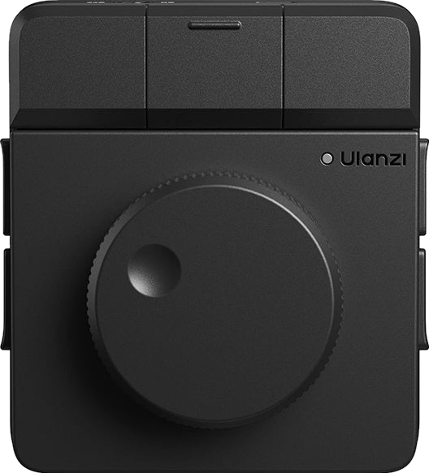
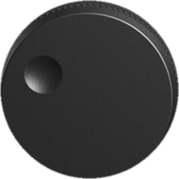

# On-screen D100H — a "gamepadviewer-style" dial skin

A drop-in way to **show the D100H on screen and make it react**: the knob **spins** when you turn it and
each key **lights up** when pressed. It's the same trick gamepad skins use — stacked PNG layers + a little
CSS/JS — and it pairs perfectly with the WebSocket-bridge in [plugin-sdk.md](plugin-sdk.md) (forward real
dial/key events to a web page, then drive this widget with them).

This is lifted from **[chumthesizer](https://github.com/brendanwelsh/chumthesizer)** (a D100H-played synth);
the full implementation is its [`src/ui/dial.ts`](https://github.com/brendanwelsh/chumthesizer/blob/main/src/ui/dial.ts).
The **assets are included here** so you can reuse the method without rebuilding them.

## The assets (`images/dial-skin/`)
All PNGs are background-knocked-out (transparent), aligned to the same 528×583 frame.

| File | What it is |
|---|---|
| `ulanzi-dial.png` | the base photo (body + keys), background removed — the bottom layer |
| `ulanzi-knob.png` | **just the knob**, as its own square layer that rotates (306×306) |
| `white-1.png` … `white-7.png` | a **white silhouette of one key each**, full-frame; hidden until that key is pressed |


*Above: the assets below, animated — `rotate()` on the knob layer + a per-key silhouette toggled on press.*

## The layer model (bottom → top)
1. **base** — `ulanzi-dial.png` at `width:100%`.
2. **7 white key silhouettes** — `white-N.png`, absolutely positioned `inset:0`, `opacity:0`; flip to
   `opacity:1` to "press" (the whole key glows white).
3. **the knob** — `ulanzi-knob.png`, absolutely positioned over the knob centre, rotated with a CSS
   `transform`.
4. **invisible hit-areas** — one transparent `<button>` per key for click/tap (optional if you only drive
   it from real hardware events).

## Geometry (percent of the base image)
The knob and the 7 key hit-areas, as **% of the 528×583 base** (so it scales with the image):

```js
// knob centre + diameter
const KNOB = { cx: 50.95, cy: 61.58, dia: 57.95 };

// key layout: 1 = bottom-left, 2 above it, 3/4/5 across the top, 6/7 down the right
const KEYS = [
  { file: "1", cx: 3.0,  cy: 62.6, w: 7.5,  h: 21.8 },
  { file: "2", cx: 3.0,  cy: 39.0, w: 7.5,  h: 22.0 },
  { file: "3", cx: 16.4, cy: 11.0, w: 29.2, h: 22.1 },
  { file: "4", cx: 47.8, cy: 11.0, w: 32.6, h: 22.1 },
  { file: "5", cx: 81.3, cy: 10.9, w: 33.3, h: 22.0 },
  { file: "6", cx: 97.0, cy: 39.0, w: 7.5,  h: 22.0 },
  { file: "7", cx: 97.0, cy: 63.3, w: 7.5,  h: 23.2 },
];
```

## Spin the knob
Map your rotation/FX value to degrees and set the knob's `transform` (keep the centring translate):

```js
// value -1..1  →  -150°..150°
knob.style.transform = `translate(-50%, -50%) rotate(${value * 150}deg)`;
```

## Press a key
Show that key's white silhouette — flash it, or **latch it while held**:

```js
function press(i){ whites[i].classList.add("on");  setTimeout(()=>whites[i].classList.remove("on"),160); }
function hold(i, on){ whites[i].classList.toggle("held", on); }   // for press-and-hold
```

## Minimal CSS
```css
.dial-device { position: relative; width: 100%; line-height: 0; }
.dial-img    { width: 100%; height: auto; display: block; }
.dwhite      { position: absolute; inset: 0; width: 100%; height: auto;
               opacity: 0; pointer-events: none; transition: opacity .04s ease;
               filter: drop-shadow(0 0 8px rgba(255,255,255,0.7)); }
.dwhite.on, .dwhite.held { opacity: 1; }                 /* key pressed = key lit */
.dial-knob   { position: absolute; transform: translate(-50%, -50%);
               transform-origin: 50% 50%; border-radius: 50%; }
.dial-knob.spin { filter: brightness(1.3) drop-shadow(0 0 12px rgba(255,255,255,0.8)); } /* glow while turning */
```

## Markup skeleton
```html
<div class="dial-device">
  
  <!-- one per key, JS toggles .on / .held -->
  
  <!-- … white-2 … white-7 … -->
  <!-- knob: position with KNOB.cx/cy/dia as left/top/width %, then rotate via transform -->
  
</div>
```

That's the whole method: **stack the layers, rotate the knob image, toggle a white silhouette per key.**
Feed it real events over a localhost WebSocket (see [plugin-sdk.md](plugin-sdk.md)) and the on-screen dial
mirrors the physical one.

---
> Device imagery derives from Ulanzi's product renders (background removed); the layered skin + geometry
> are from [chumthesizer](https://github.com/brendanwelsh/chumthesizer). Reuse for your own D100H project.
