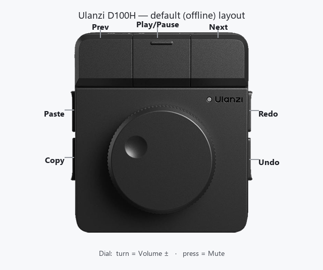

# Offline (Standalone) mode — default codes

With Ulanzi Studio **not running**, the D100H sends a fixed set of standard HID codes. **These are not
customizable and do not change even if you remap things in Studio** — custom layouts don't persist to
the device (see [ulanzi-studio.md](ulanzi-studio.md)).

## Default map
| Control | Sends | HID page | Readable? |
|---|---|---|---|
| Dial rotate CW | Volume Up (`0xE9`) | Consumer | ✅ |
| Dial rotate CCW | Volume Down (`0xEA`) | Consumer | ✅ |
| Dial press | Mute (`0xE2`) | Consumer | ✅ |
| Button | Previous Track (`0xB6`) | Consumer | ✅ |
| Button | Play / Pause (`0xCD`) | Consumer | ✅ |
| Button | Next Track (`0xB5`) | Consumer | ✅ |
| Button | Copy = Ctrl+C | Keyboard | ❌ |
| Button | Paste = Ctrl+V | Keyboard | ❌ |
| Button | Undo = Ctrl+Z | Keyboard | ❌ |
| Button | Redo = Ctrl+Y | Keyboard | ❌ |

Per the official manual, the standalone presets are: *Previous, Play/Pause, Next, Knob, Paste, Copy,
Undo, Redo* — which matches the above (3 media buttons + 4 editing shortcuts + the volume knob).

## Physical layout & what the side buttons do (offline)
The D100H has **7 keys arranged around the dial** — 3 across the top, and 4 on the sides (2 left,
2 right) — plus the dial in the middle:



```text
        [ Prev ]  [ Play/Pause ]  [ Next ]      top 3 = media transport (HID-readable)

   [ Paste ]                            [ Redo ]
   [ Copy ]            ( DIAL )         [ Undo ]    4 side keys = editing shortcuts (NOT readable)
                rotate = vol ± / press = mute
```

**Offline, the four side buttons are editing shortcuts:** they emit `Ctrl+C` (Copy), `Ctrl+V` (Paste),
`Ctrl+Z` (Undo), and `Ctrl+Y` (Redo). So with Ulanzi Studio closed, pressing a side button simply
copies / pastes / undoes / redoes in whatever application currently has focus. Consequences:
- They are **not configurable** offline (the D100H has no custom standalone layout — see
  [ulanzi-studio.md](ulanzi-studio.md)).
- They ride the system **Keyboard** HID interface, so they are **invisible to `node-hid`** on Windows:
  you can't read them, and you can't safely repurpose Ctrl+C/V/Z/Y anyway.

The **top three keys** are media transport (Previous / Play-Pause / Next) on the **Consumer** interface,
which *is* readable — those are the only buttons a HID-only homebrew can actually use.

> This layout and the per-key functions are **confirmed by the official Ulanzi D100H manual** (see
> [specs.md](specs.md) for the official diagram): top = Prev / Play-Pause / Next; left = Paste (top) /
> Copy (bottom); right = Redo (top) / Undo (bottom); dial = volume / mute.

## Consumer Control report format
Reports on the Consumer interface (`usagePage 0x0c`) are 3 bytes — a report id, then a little-endian
16-bit usage code:
```
[ 0x02, usageLow, usageHigh ]

02 E9 00   → Volume Up
02 EA 00   → Volume Down
02 E2 00   → Mute
02 B6 00   → Previous Track
02 CD 00   → Play / Pause
02 B5 00   → Next Track
02 00 00   → release (key up) — ignore
```
Note: `node-hid` may or may not prepend a leading report-id byte depending on the device/OS. Scan for
the start of the frame rather than hard-coding an offset.

## What this means for homebrew
- You **can** drive your own software from the dial + the 3 media buttons by reading the Consumer
  interface — **but** those are real volume/media keys, so the OS will *also* act on them (your volume
  moves, your media skips) unless you suppress the keys at the OS level (e.g. a low-level hook). Note a
  global media-key hook can't tell the dial apart from your keyboard's media keys.
- The 4 Ctrl-key buttons are effectively **unusable** for HID-only homebrew on Windows: you can't read
  them, and you can't safely repurpose Ctrl+C/V/Z/Y anyway.
- **Net:** a true "no Ulanzi app" build caps at **dial + 3 buttons, with volume/media side effects.**
  For all 7 buttons cleanly, you need Ulanzi Studio running (a plugin, or a hotkey remap + a listener).
