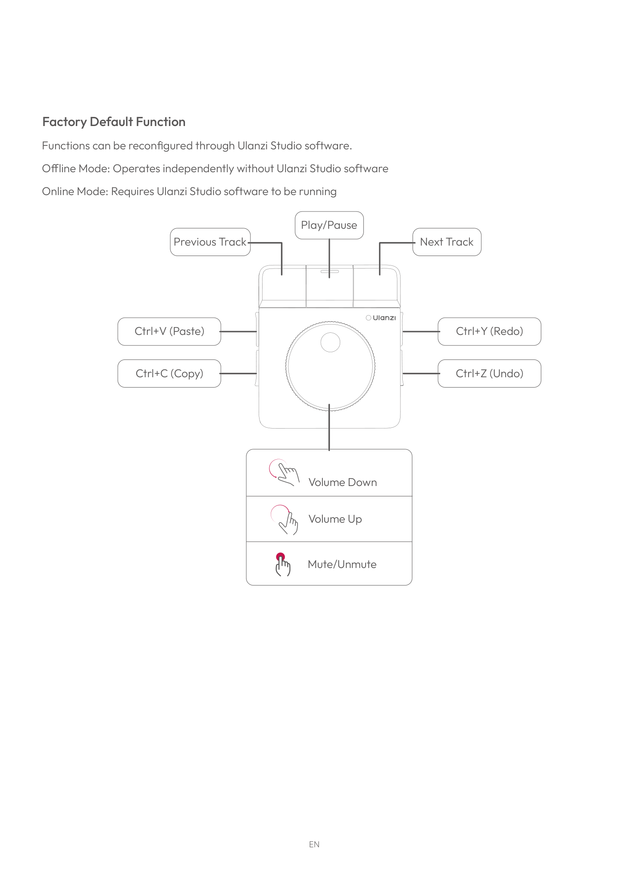

# Specifications & confirmed layout (from the official manual)

All values below are from the official **Ulanzi D100H** user manual (model D100H, "Dial Editing Assistant").

## Confirmed button layout
The manual's *Factory Default Function* page confirms the 7-key + dial layout (and the exact offline map):

*Figure © Ulanzi, from the official D100H manual (linked in [resources.md](resources.md)) — included for reference.*

- **Top row (3 keys):** Previous Track · Play/Pause · Next Track — media transport (**Consumer** HID page, readable)
- **Left side:** Paste (Ctrl+V, top) · Copy (Ctrl+C, bottom)
- **Right side:** Redo (Ctrl+Y, top) · Undo (Ctrl+Z, bottom) — the 4 editing keys (**Keyboard** HID page, not readable on Windows)
- **Dial:** rotate = Volume Up / Volume Down · press = Mute/Unmute

There is also a separate **device-switch button** (not one of the 7 macro keys): short-press cycles the
up-to-3 paired Bluetooth devices; press-and-hold 3 s enters pairing mode (status LED 1/2/3 shows the active device).

## Indicator lights (LED meanings)
> **Source: the official Ulanzi D100H manual** (the Manuals+ transcriptions + the official PDF linked in
> [resources.md](resources.md)), with the charge colour **confirmed red on our unit**.

**What the red light means → the device is charging.** The charge LED is the clearest colour indicator:

| LED state | Meaning |
|---|---|
| **Red, steady** | **Charging** |
| **Green, steady** | Fully charged / charge complete |
| Indicator **flashing** (after holding the device-switch button ~3 s) | In Bluetooth **pairing** mode |
| Indicator **off** | Connected to a host successfully |
| Status LED **1 / 2 / 3** | Which of the up-to-3 paired devices is currently active (see the device-switch button above) |
| Status LED **[1] flashing** on power-up after the reset combo | **Factory reset** complete (see below) |

Note the **flashing** states are pairing / factory-reset, *not* charging — a **steady** colour is the
battery/charge indicator, so a blinking light is never the charge state.

## Specs
| | |
|---|---|
| Model | D100H ("Dial Editing Assistant") |
| Bluetooth | **BLE 5.1**, range ≥10 m; advertised name **"UlanziDial"** |
| Connection | Bluetooth only — **USB-C is charge-only (no data mode)** |
| Paired devices | up to 3 simultaneously |
| Battery | 3.7 V 1000 mAh Li-Po · max draw ~400 mA · standby ~200 µA |
| Battery life | **Up to ~60 days standby**, but only **~2.5 h of *continuous dial rotation*** — that's worst case, since the haptic linear motor is the big power draw. Everyday key/press use (motor idle) lasts far longer, much closer to the standby end than to 2.5 h. |
| Charging | Type-C, 5 V ⎓ 2 A · **~2.5 h** for 0→100% |
| Weight | 260 g |
| Materials | ABS+PC body, aluminium-alloy knob, silicone anti-slip pad; built-in magnetic mount |
| OS support | Windows 10+ · macOS 11+ (Intel) / 10.13+ (Apple Silicon) |

_Battery-life figures (≈60-day standby / ≈2.5 h continuous-rotation / ≈2.5 h charge) are Ulanzi's official
[product-page](https://www.ulanzi.com/products/d100h-dial-creative-controller-i003) claims; capacity,
standby current and max draw are from the manual. None of the runtime numbers were independently
bench-measured here._

## Factory reset
Power off → hold **Knob + device-switch button** together → power on → status LED [1] flashes = reset complete.

> Over HID the device enumerates as **"KEHWIN / Dial_Lite", VID `0xfff1` / PID `0x0082`** (the BLE-chipset
> identity), even though its advertised Bluetooth name is **"UlanziDial"**. See [hardware.md](hardware.md).
